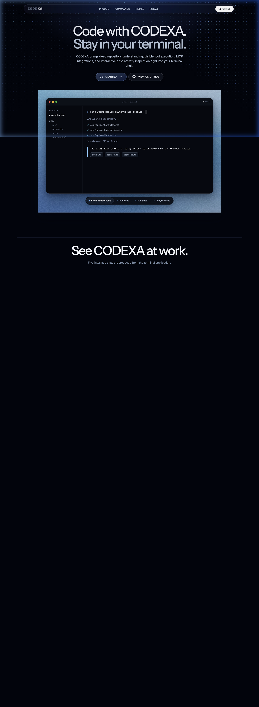
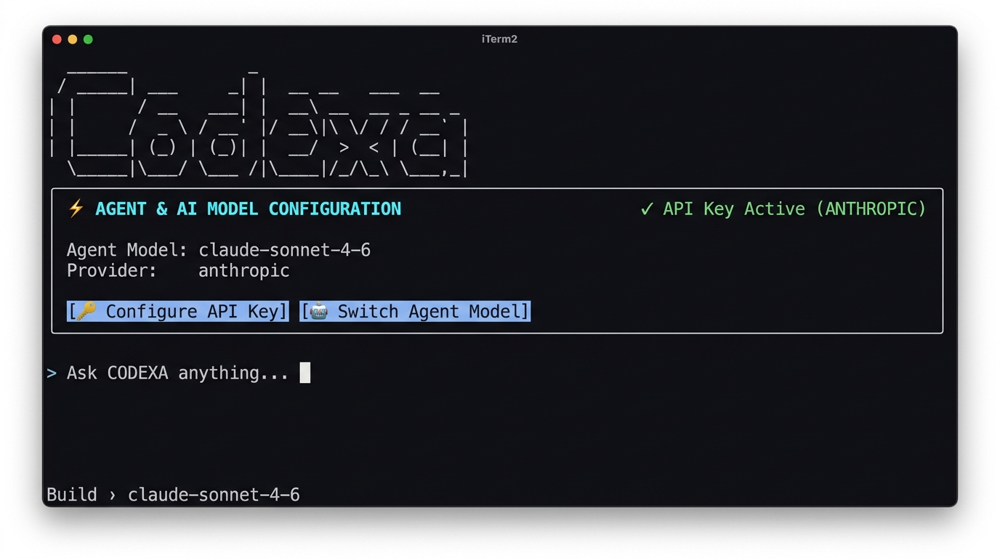

<p align="center">
  
</p>

<p align="center">
  <a href="https://github.com/Aaravkhanal/CODEXA/actions/workflows/ci.yml"></a>
  <a href="https://github.com/Aaravkhanal/CODEXA/releases"></a>
  <a href="https://github.com/Aaravkhanal/CODEXA/blob/main/LICENSE"></a>
  <a href="https://github.com/Aaravkhanal/CODEXA/actions/workflows/codeql-analysis.yml"></a>
  <a href="https://codecov.io/gh/Aaravkhanal/CODEXA"></a>
</p>

<p align="center">
  <a href="https://github.com/Aaravkhanal/CODEXA/releases">Releases</a>
  ·
  <a href="./docs/RELEASING.md">Release Guide</a>
  ·
  <a href="./CONTRIBUTING.md">Contributing</a>
  ·
  <a href="./docs/DEVELOPMENT.md">Development</a>
  ·
  <a href="./SUPPORT.md">Support</a>
  ·
  <a href="./packages/web">Landing Page</a>
</p>

# CODEXA

> **Elevator Pitch:** CODEXA is a high-performance, terminal-native AI coding agent built with Bun, TypeScript, and OpenTUI for lightning-fast PLAN & BUILD workflows without leaving your shell.

---

### Key Technical Architecture Highlights

1. **Dual Execution Engine (PLAN vs. BUILD)**: Strict isolation of read-only codebase exploration (PLAN mode) from active multi-file mutations and terminal execution (BUILD mode).
2. **CodexaLens Code Intelligence**: Fast local AST & regex dependency graph analyzer, active context timeline recorder, and token/credit usage tracking engine.
3. **Isolated MCP Plugin Engine**: Dynamic tool discovery and policy enforcement supporting both stdio and HTTP Model Context Protocol (MCP) servers via `.codexa/mcp.json`.

---

### 💬 What I'd Talk About in an Interview

- **Monorepo Architecture & Bun Ecosystem**: Managing multi-package TypeScript applications (`cli`, `server`, `database`, `shared`, `web`) with Bun's native workspace runner, single-file compilation, and fast test framework.
- **Pseudoterminal (PTY) Testing & UI Engineering**: Building deterministic terminal UI components with OpenTUI and testing CLI workflows end-to-end using PTY automation scripts in CI.
- **Security Boundaries & Tool Isolation**: Designing fail-closed authentication middleware, environment isolation, and fine-grained tool execution permissions for LLM agents.

---

## Highlights

- Terminal-first coding workflow with a focused OpenTUI interface.
- PLAN mode for read-only investigation and BUILD mode for implementation.
- **Post-edit BUILD verification loop**: automatically detects and runs your project's test/lint command after file edits, feeds failures back for one bounded retry, and logs every attempt to the CodexaLens Timeline.
- **🔒 Local-Only Semantic Search**: on-disk TF-IDF code search inside `/lens` — zero external API calls, 100% private.
- **`codexa lens export`**: dumps a completed session's Timeline, test results, token cost, and diff summary into a self-contained HTML report for PR descriptions.
- **Opt-in Docker Sandbox** for BUILD-mode shell commands (`--sandbox` / `CODEXA_SANDBOX=true`). Direct host execution remains the default. CLI output explicitly shows `[Sandboxed Execution: docker]` vs `[Host Execution: direct]`.
- **Per-command approval granularity**: `always_allow`, `ask`, `deny` rules matchable by tool name or command regex. Fail-closed by default (unlisted = `ask`; PLAN mode write tools = `deny`).
- **Sub-agent delegation**: BUILD sessions can spawn scoped child agents with their own token budget, isolated system prompt, and PLAN/BUILD state via the CODEXA `/chat` endpoint or direct provider keys, with offline fallback; results appear as nested Timeline entries.
- **`bun run bench` & Agent-Backed Tasks**: reproducible local benchmark harness supporting both offline tool verification and live agent-backed tasks (`agentPrompt`) with per-task cost and token tracking (`bun run bench`, `bun run bench --live`). See [docs/BENCHMARKS.md](./docs/BENCHMARKS.md).
- **CI Code-Signing & Notarization**: GitHub Actions release pipeline supports automated macOS `codesign` + `notarytool` and Windows Authenticode `signtool` binary signing.
- `codexa doctor` for environment, API key, and MCP config diagnostics.
- Persistent sessions that can be reopened from `/sessions`.
- Model selection, agent switching, login, and themes from the command menu.
- CodexaLens for local code exploration, workspace search, dependency context, and replaying agent activity.
- MCP server discovery through project-local `.codexa/mcp.json`.
- GitHub Releases for standalone binaries on macOS, Linux, and Windows.
- Homebrew support for macOS and Linux installs.
- Static landing page in `packages/web`.

## Install

### Clone & Run Directly

Anyone can clone this repository and run CODEXA locally without setting up an external database or server:

```sh
# 1. Clone the repository
git clone https://github.com/Aaravkhanal/CODEXA.git
cd CODEXA

# 2. Install locked dependencies (requires Bun 1.3+)
bun install --frozen-lockfile

# 3. Launch the terminal client directly
bun run dev:cli

# Or build a local standalone binary executable for your platform:
bun run release:build
```

When launched, the CLI displays the **Agent & AI Model Configuration** section. Simply enter your Anthropic or OpenAI API key to start interacting immediately!

### Homebrew

```sh
brew install codexa/tap/codexa
```

### macOS and Linux

```sh
curl -fsSL https://raw.githubusercontent.com/Aaravkhanal/CODEXA/main/install.sh | sh
```

Alpine Linux users must install the C++ runtime libraries first:

```sh
apk add --no-cache libstdc++ libgcc
```

### Windows PowerShell

```powershell
irm https://raw.githubusercontent.com/Aaravkhanal/CODEXA/main/install.ps1 | iex
```

Standalone binaries are also available from
[GitHub Releases](https://github.com/Aaravkhanal/CODEXA/releases). They include
the Bun runtime, so users do not need to install Bun or Node.js to run CODEXA.

Current binaries are unsigned. macOS may require manual approval in Privacy &
Security, and Windows may display a Microsoft Defender SmartScreen warning.
Published SHA-256 checksums and GitHub attestations can be used to verify each
download.

## Update CODEXA

Update CODEXA using the same installation method you originally used. Avoid
mixing Homebrew and standalone installations, as multiple `codexa` binaries on
your `PATH` can cause an older version to run.

### Homebrew

```sh
brew update && brew upgrade codexa
```

### macOS and Linux standalone installer

Rerun the installer to download the latest release and replace the existing
binary:

```sh
curl -fsSL https://raw.githubusercontent.com/Aaravkhanal/CODEXA/main/install.sh | sh
```

### Windows PowerShell standalone installer

Rerun the installer, then restart the terminal so the updated executable is
used:

```powershell
irm https://raw.githubusercontent.com/Aaravkhanal/CODEXA/main/install.ps1 | iex
```

Verify the installed version on any platform:

```sh
codexa --version
```

> [!NOTE]
> The `/upgrade` command manages CODEXA billing. It does not update the CLI.

## Agent & AI Model Configuration

When CODEXA starts, the home screen features an **Agent & AI Model Configuration** panel at the top:

<p align="center">
  
</p>

- **Agent Model Selection**: Choose your preferred AI model (`claude-sonnet-4-6`, `gpt-5.4`, `claude-opus-4-6`, `gpt-4o`, etc.).
- **Local API Key Storage**: Keys are stored locally in `~/.codexa/api-keys.json` with restricted permissions (`0600`).
- **Interactive Setup**: Select **🔑 Configure API Key** or **🤖 Switch Agent Model** at any time to update your provider keys or switch model agents.

## Usage

Start CODEXA from inside any project directory:

```sh
cd path/to/project
codexa
```

Common commands:

| Command | Purpose |
| --- | --- |
| `/new` | Start a new conversation |
| `/agents` | Switch between PLAN and BUILD agents |
| `/models` | Select the AI model & update API keys |
| `/sessions` | Browse previous sessions |
| `/lens` | Explore the local codebase and inspect agent activity |
| `/neolens` | Alias for `/lens` — explore code and replay activity |
| `/mcp` | Inspect configured MCP servers and tool access |
| `/theme` | Change the terminal theme |
| `/login` | Sign in through the browser |

Use `API_URL` to point the CLI at a different CODEXA API during development:

```sh
API_URL=http://localhost:3000 codexa
```

## CodexaLens

CodexaLens is CODEXA's local codebase explorer and execution-inspection workspace.
It can be opened before a conversation to browse and search the current repository.
During a session it also tracks file reads, edits, checks, failures, dependency
relationships, model usage, duration, and estimated generation cost so you can
understand what changed and why.

Open it at any time with:

```text
/lens
```

The full-screen interface provides three views:

- **Graph** shows TypeScript dependency relationships and highlights files touched
  by the agent.
- **Workspace** provides read-only, line-numbered file previews plus capped filename
  and content search, powered by a **🔒 100% local-only TF-IDF semantic index** — no code ever leaves your machine. Press `/` to search, `Enter` to open a file, `Tab` to switch panes, and `j`/`k` or the arrow keys to navigate.
- **Timeline** replays tool activity and summarizes changed files, failures, model
  runs, tokens, elapsed time, and estimated cost. Sub-agent delegations appear as
  nested Timeline entries under the parent session.

Use `F1`, `F2`, and `F3` to switch between Graph, Workspace, and Timeline when an
active session is available. Selecting a file or event and pressing `Enter` opens
the relevant source file in the Workspace view.

### Session Export

Export a completed session as a standalone HTML report:

```sh
codexa lens export [output.html]
```

The report contains the full Timeline, test/lint results, files modified, token
cost, and estimated spend — suitable for including in PR descriptions.

CodexaLens is intentionally project-scoped and source stays on the local machine;
the Railway API receives session activity but does not receive file contents.
CodexaLens respects common generated directories and root `.gitignore` rules, never
follows symbolic links, hides common credential files, rejects paths outside the
project, and caps indexing, search, and preview work to remain responsive on large
repositories. Start CODEXA inside a real repository so local paths can be resolved
safely.

## MCP Integrations

CODEXA discovers MCP servers from `.codexa/mcp.json` (or `.neocode/mcp.json` as a fallback) in the active project.
MCP is optional; without it, CODEXA's built-in local tools continue to work.

Start from the included example:

```sh
mkdir -p .codexa
cp .codexa/mcp.example.json .codexa/mcp.json
```

Every MCP tool is denied by default and must have an explicit access policy:

| Policy | Availability |
| --- | --- |
| `read` | Available in PLAN and BUILD modes |
| `write` | Available only in BUILD mode |
| `disabled` | Never exposed to the model |

The special `"*"` policy can classify every otherwise-unlisted tool from a
server, but explicit per-tool policies are recommended.

Secrets should use environment references such as `${env:GITHUB_TOKEN}`.
Resolved secret values stay in the server process and are not returned by the MCP
inspection API. Local stdio servers receive only a small safe set of inherited
process variables plus variables declared in their own `env` block.

Supported transports:

- `stdio` for local MCP server processes.
- Streamable HTTP for remote MCP servers.

MCP clients are scoped to a response or inspection request and always closed
after completion, failure, or interruption.

## Repository Layout

| Path | Purpose |
| --- | --- |
| `packages/cli` | Terminal UI and `codexa` command |
| `packages/server` | API, auth, chat routes, billing hooks, MCP runtime, CodexaLens routes |
| `packages/shared` | Shared schemas, model metadata, and CodexaLens graph types |
| `packages/database` | Prisma schema, generated client, and database adapter |
| `packages/web` | Vite React landing page |
| `scripts` | Release, packaging, Homebrew, and smoke-test scripts |
| `docs` | Release and operational documentation |

## Development

See the [development guide](./docs/DEVELOPMENT.md) for prerequisites, local
PostgreSQL setup, environment variables, and the full contributor workflow.

Install dependencies:

```sh
bun install --frozen-lockfile
```

Run the API server:

```sh
bun run dev:server
```

Run the terminal client:

```sh
bun run dev:cli
```

Run the landing page:

```sh
bun run dev:web
```

Build the landing page:

```sh
bun run build:web
```

Run tests:

```sh
bun test
```

Run the complete local quality gate (lint + typecheck + test + web build):

```sh
bun run check
```

Run the benchmark harness (pass/fail verification tasks + agent-backed tasks + cost estimates):

```sh
bun run bench          # run all benchmark tasks
bun run bench --live   # run benchmark with live agent execution
bun run bench:dry      # list tasks without executing
```

See [docs/BENCHMARKS.md](./docs/BENCHMARKS.md) for methodology and how to add tasks.

## Releases

CODEXA releases publish standalone CLI archives for macOS, Linux, and Windows
through GitHub Releases. Homebrew formula updates are handled through the
configured tap repository.

See [docs/RELEASING.md](./docs/RELEASING.md) for the full release and Homebrew
process.

## Contributing

Contributions are welcome. Please read
[CONTRIBUTING.md](./CONTRIBUTING.md) before opening a pull request.

## License

CODEXA is released under the [MIT License](./LICENSE).
