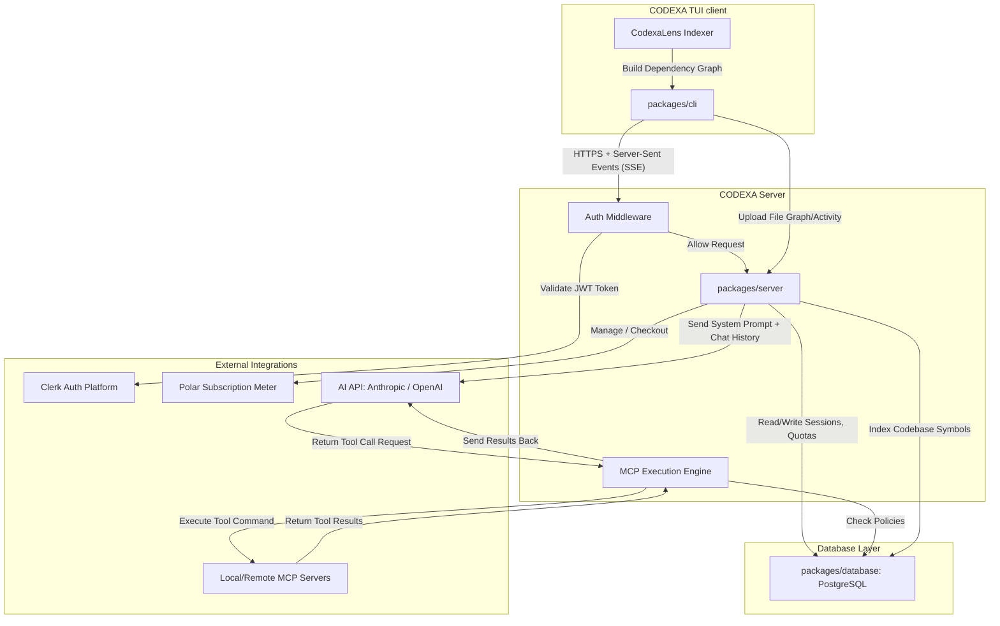

# CODEXA Monorepo Architecture

This document provides a high-level overview of the CODEXA architecture, monorepo structure, component relationships, data flow, and runtime mechanics.

## Repository Overview

CODEXA is organized as a pnpm/bun-compatible monorepo containing multiple packages under the `packages/` directory:

```text
CODEXA (Root)
├── packages/
│   ├── cli/         # Interactive TUI terminal UI, command menu, themes, local user storage
│   ├── server/      # Hono HTTP API server: chat sessions, MCP tool execution, CodexaLens API
│   ├── shared/      # TypeScript types, schema validations (Zod), and common utilities
│   ├── database/    # Prisma Schema, migrations, and PostgreSQL client setup
│   └── web/         # Vite/React landing page
├── docs/            # Developer, security, and architectural documentation
└── scripts/         # Automated release building, packaging, and setup tools
```

---

## High-Level Component Architecture

The diagram below details the interaction model between the CLI client, Server API, PostgreSQL database, AI model providers, and local/remote MCP Servers.



---

## Component Details

### 1. packages/cli
- **Technology**: Bun, React, Ink (OpenTUI)
- **Role**: Provides the user interface directly inside the terminal. It handles terminal drawing, shortcut keys, configuration loading (like local configurations from `~/.codexa/`), and interactive shell mode.
- **State**: TUI state is handled in-memory. Persistent developer configuration and session cache are stored inside `~/.codexa/` on the user's filesystem.

### 2. packages/server
- **Technology**: Bun, Hono framework, Zod validation
- **Role**: Exposes the main backend endpoints for authentication, model configuration, session CRUD, chat stream connections (SSE), billing checkout/portal, and telemetry/metadata APIs.
- **Execution Model**: The server is stateless, running on Bun with hot-reloading capability for local development.

### 3. packages/shared
- **Technology**: TypeScript
- **Role**: Shared schema validations and common utilities. It contains standard Zod schemas for the model list, message formats, tool executions, and server environment parsing (`env-schema.ts`).
- **Benefits**: Zero runtime overhead; compile-time safety boundaries across packages.

### 4. packages/database
- **Technology**: Prisma ORM, PostgreSQL
- **Role**: Governs the database schema definitions and migrations.
- **Client**: Generates a typed Prisma Client consumed by `packages/server` to query PostgreSQL.

---

## Core Flows & Processes

### 1. User Authentication Flow
1. User logs in/registers via the landing page or OAuth.
2. Clerk issues a JSON Web Token (JWT).
3. The TUI CLI client sends this JWT in the `Authorization: Bearer <token>` header for all API requests.
4. Server interceptor `requireAuth` parses and validates the token signature using Clerk keys and populates user info.

### 2. LLM Tool Execution & MCP (Model Context Protocol) Flow
1. User enters a query requiring file edits or bash executions (e.g. `/new` or `BUILD` mode).
2. The Server sends the request to the configured LLM (Anthropic/OpenAI) including registered tool contracts.
3. The LLM returns a `tool-call` request.
4. The Server intercepts the tool call, matches it with the execution engine (`packages/server/src/mcp`), validates access permissions against security policies, runs the tool (via local runner or sub-server), and feeds the results back to the LLM.
5. The LLM synthesizes the final response and streams it back to the user.

### 3. CodexaLens Codebase Context Flow
1. CodexaLens runs inside the client workspace to scan directories, parse file hierarchies, and resolve TypeScript/JavaScript import graphs.
2. The index builds dependency relationships (nodes and edges) locally.
3. CodexaLens synchronizes the graph and workspace preview events with the server's workspace index database.
4. When the user asks a question, the server queries CodexaLens indexing to fetch relevant symbol relationships and source code snippets, injecting them into the LLM system prompt context.
